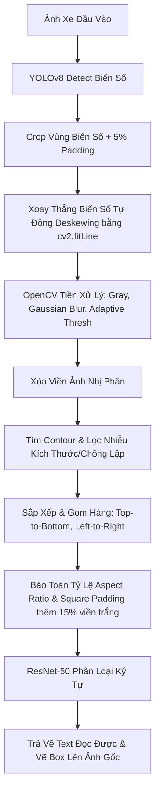

# 🚗 YOLOv8 + ResNet-50 License Plate Recognition System

Dự án nhận diện biển số xe (License Plate Recognition) sử dụng sự kết hợp của:
1. **YOLOv8**: Định vị và cắt (crop) vùng biển số xe từ ảnh đầu vào.
2. **OpenCV (Adaptive Thresholding)**: Tiền xử lý ảnh vùng biển số và phân tách (segmentation) từng ký tự riêng lẻ.
3. **ResNet-50 Classifier**: Nhận diện ký tự chữ cái và chữ số cho từng phân đoạn đã cắt sau khi được fine-tune trên tập ký tự biển số xe thực tế của Việt Nam.

---

## 📂 Cấu trúc thư mục của Module ResNet
```text
License-plate-resnet/
├── dataset/                  # Tập dữ liệu ký tự thực tế + synthetic chia theo thư mục (0-Z)
├── cropped_chars/            # Thư mục lưu các ký tự đã phân đoạn sau khi chạy test_cli
├── resnet50_chars74k.pth     # Trọng số ResNet50 pre-trained trên Chars74k (62 lớp)
├── resnet50_finetuned.pth    # Trọng số ResNet50 sau khi fine-tune trên tập biển số thực (31 lớp) - ƯU TIÊN SỬ DỤNG
├── create_fine_tune_dataset.py # Tự động hóa trích xuất và dán nhãn ký tự từ YOLO dataset
├── fill_synthetic_data.py    # Sinh thêm ảnh ký tự giả lập bằng OpenCV để cân bằng tập dữ liệu
├── train_resnet.py           # Script đóng băng backbone và huấn luyện chuyển vị lớp phân loại
├── test_cli.py               # Script chạy kiểm thử nhận diện qua dòng lệnh (CLI)
├── app.py                    # Giao diện ứng dụng Gradio (Web App UI)
└── README.md                 # Hướng dẫn sử dụng dự án (file này)
```

---

## 🛠️ Hướng dẫn cài đặt và khởi chạy

### 1. Kích hoạt môi trường ảo (Virtual Environment)
Dự án đã có sẵn môi trường ảo `orc_env`. Chạy lệnh sau trong PowerShell của Windows để kích hoạt:
```powershell
# Từ thư mục gốc: license-place-detector
orc_env\Scripts\activate
```

### 2. Chuẩn bị dữ liệu và Huấn luyện (Fine-tune) mô hình
Nếu muốn sinh lại tập dữ liệu và tự train lại mô hình từ đầu, thực hiện các bước sau:
```powershell
# Bước A: Trích xuất ký tự thực tế từ bộ dữ liệu Roboflow (YOLO + PaddleOCR tự động gán nhãn)
python License-plate-resnet/create_fine_tune_dataset.py

# Bước B: Điền đầy các lớp dữ liệu bị thiếu/ít bằng ảnh ký tự giả lập OpenCV
python License-plate-resnet/fill_synthetic_data.py

# Bước C: Thực hiện fine-tune model ResNet-50 (Lưu checkpoint tốt nhất vào resnet50_finetuned.pth)
python License-plate-resnet/train_resnet.py
```

### 3. Chạy thử nghiệm qua Command Line (CLI)
Để kiểm tra nhanh thuật toán phân đoạn và phân loại trên ảnh mẫu:
```powershell
python License-plate-resnet/test_cli.py
```
*Kết quả nhận diện sẽ hiển thị trên console và ảnh vẽ khung nhận diện biển số cùng mã ký tự sẽ được lưu tại `License-plate-resnet/output_result.jpg`.*

### 4. Khởi chạy Giao diện Web (Gradio App)
```powershell
python License-plate-resnet/app.py
```
Sau khi chạy, truy cập đường link hiển thị ở console (thường là `http://127.0.0.1:7860`) trên trình duyệt để sử dụng.

---

## 📊 Quy trình tạo Dataset & Fine-tuning

### 1. Tạo tập dữ liệu (Dataset Generation)
Để khắc phục sự khác biệt về font chữ giữa bộ dữ liệu tiếng Anh gốc (Chars74k) và biển số Việt Nam, một quy trình thu thập và cân bằng dữ liệu được triển khai tự động:
*   **Trích xuất tự động (`create_fine_tune_dataset.py`)**: 
    1. Model YOLOv8 định vị biển số xe từ bộ dữ liệu Roboflow.
    2. PaddleOCR đọc văn bản của biển số.
    3. OpenCV phân đoạn biển số thành các bounding box ký tự.
    4. Nếu số lượng hộp phân đoạn khớp 1-1 với độ dài văn bản OCR, từng ký tự nhị phân đảo màu (chữ đen, nền trắng) sẽ được trích xuất thành ảnh kích thước `64x64` và phân loại tự động vào các thư mục `dataset/0/` đến `dataset/Z/`.
*   **Sinh dữ liệu giả lập cân bằng lớp (`fill_synthetic_data.py`)**: 
    *   Các ký tự hiếm gặp trên biển số thực tế (như `B`, `C`, `E`, `K`, `Z`,...) sẽ được sinh tự động bằng OpenCV với các font chữ tiêu chuẩn.
    *   **Cải tiến tỷ lệ khung hình (Aspect Ratio Alignment)**: Thay vì vẽ chữ trực tiếp lên khung hình vuông làm phình rộng nét chữ, ảnh ký tự được crop sát viền và kéo giãn/thu nhỏ về tỷ lệ chiều rộng/chiều cao tiêu chuẩn **0.35** (trùng khớp với hình dạng thon cao của ký tự biển số thật).
    *   **Sinh ký tự số `4` hở đầu (Open-top `4`)**: Sinh procedurally ký tự số `4` hở đầu bằng các nét vẽ OpenCV (`cv2.line`) thay vì dùng font máy tính (thường có nét đóng kín ở trên đầu), giúp loại bỏ hoàn toàn sự nhận nhầm số `4` thành `0` hay chữ `L`.
    *   Áp dụng các phép biến dạng dữ liệu ngẫu nhiên (xoay ngẫu nhiên từ $-10^\circ$ đến $+10^\circ$, dịch chuyển tịnh tiến pixel, co giãn kích thước, và Gaussian Blur nhẹ) để giả lập ảnh chụp camera thực tế.
    *   **Kết quả:** Tất cả 31 lớp hợp lệ của biển số Việt Nam (`0123456789ABCDEFGHKLMNPRSTUVXYZ`) đều có chính xác **100 ảnh mẫu**, đạt tổng cộng **3,100** ảnh huấn luyện.

### 2. Huấn luyện Fine-tuning (`train_resnet.py`)
Mô hình sử dụng phương pháp **Transfer Learning** nhưng mở rộng nâng cao:
*   **Huấn luyện toàn bộ mô hình (Full Fine-tuning)**: Cho phép huấn luyện và tối ưu hóa tất cả các tầng (layers) của ResNet-50 thay vì chỉ đóng băng backbone và train duy nhất classifier head. Điều này giúp các tầng tích chập thích ứng tối đa với đặc trưng nét chữ riêng biệt của biển số Việt Nam.
*   **Thay thế lớp phân loại cuối cùng (`model.fc`)** từ 62 lớp (của Chars74k ban đầu) thành **31 lớp** (dành riêng cho biển số Việt Nam).
*   Sử dụng bộ tối ưu **Adam Optimizer** với tốc độ học nhỏ ($lr=10^{-4}$) nhằm tránh làm hỏng các trọng số pre-trained tốt trước đó.
*   **Kết quả vượt trội:** Đạt độ chính xác Validation phân loại ký tự lên tới **99.57%** chỉ sau 15 epochs huấn luyện (chưa đầy 3 phút trên GPU).

---

## 🔬 Thuật toán xử lý và Pipeline của App

Khi người dùng tải ảnh lên hoặc chọn ảnh mẫu trong giao diện Gradio, hệ thống sẽ thực thi luồng xử lý (pipeline) tuần tự sau:



### Bước 1: Phát hiện biển số (YOLOv8)
*   Sử dụng mô hình YOLOv8 (`best.pt`) để tìm vị trí biển số xe.
*   Cắt ảnh biển số kèm theo 5% padding xung quanh để tránh làm mất nét các ký tự sát viền.

### Bước 2: Tự động xoay thẳng biển số (Deskewing - Cải tiến)
*   Đối với các biển số bị nghiêng do góc chụp camera (như ảnh xe `car4.jpg`), hệ thống tự động cân thẳng trước khi bóc tách ký tự:
    1. Tìm trọng tâm (centroids) của các vùng ký tự ứng viên.
    2. Sử dụng giải thuật khớp đường thẳng tuyến tính `cv2.fitLine` (L2 distance) đi qua các trọng tâm này để tìm ra góc nghiêng chính xác của biển số.
    3. Thực hiện xoay ảnh bằng phép biến đổi Affine (`cv2.warpAffine`) với thuật toán nội suy song tuyến tính/trực quan. Phần viền trống phát sinh khi xoay được điền tự động bằng màu trung vị của 4 góc biển số gốc để bảo toàn cấu trúc nền.
*   **Kết quả:** Phục hồi toàn bộ các ký tự bị che khuất hoặc dính hàng do độ nghiêng của biển số (ví dụ: khôi phục thành công biển số nghiêng `51G-100.96`).

### Bước 3: Phân tách ký tự (OpenCV)
*   Chuyển vùng ảnh biển số sang Grayscale, làm mịn bằng **Gaussian Blur** khử nhiễu.
*   Sử dụng **Adaptive Thresholding** (ngưỡng động cục bộ) để chuyển ảnh sang nhị phân nhằm đối phó với hiện tượng bóng mờ và chênh lệch độ sáng.
*   **Xóa viền ảnh nhị phân** bằng cách vẽ một viền đen quanh rìa để ngắt kết nối các đốm nhiễu của viền biển số dính vào ký tự.
*   Tìm kiếm contours và lọc bỏ dựa trên:
    *   Tỷ lệ chiều cao so với biển số (20% - 95%).
    *   Tỷ lệ chiều rộng so với biển số (< 40%).
    *   Tỷ lệ khung hình (aspect ratio) thích hợp cho chữ/số.
    *   Loại bỏ các contour lồng nhau hoặc có diện tích chồng lấp lớn (> 70%).

### Bước 4: Sắp xếp theo dòng và Outlier Pruning
*   **Gom cụm dòng**: Phân tích tọa độ tâm Y của các ký tự để tự động phân biệt biển số 1 dòng (dài) hay 2 dòng (vuông).
*   **Lọc ngoại lai (Pruning)**: Dùng trung vị (median) chiều cao và vị trí Y của từng dòng để loại bỏ các đốm nhiễu nhỏ dính bên dưới hoặc trên cùng biển số.
*   **Sắp xếp**: Sắp xếp thứ tự dòng từ trên xuống dưới, và các ký tự trong mỗi dòng từ trái qua phải.

### Bước 5: Chuẩn hóa bảo toàn tỷ lệ khung hình (Aspect Ratio Preservation)
*   Ký tự sau khi crop sẽ được đưa về dạng hình vuông **64x64** trước khi nạp vào ResNet-50.
*   *Giải pháp:* Sử dụng hàm `make_square_with_padding` thêm đệm viền trắng đối xứng vào cạnh ngắn hơn của ảnh ký tự nhị phân, sau đó mới resize về 64x64. Việc này giúp giữ nguyên tỷ lệ tự nhiên của nét chữ, loại bỏ hiện tượng biến dạng làm nhận diện sai chữ số.

### Bước 6: Nhận diện ký tự (ResNet-50)
*   Từng ký tự vuông đã chuẩn hóa 64x64 (chữ đen, nền trắng) được nạp vào ResNet-50 (`resnet50_finetuned.pth`).
*   Mô hình dự đoán ra 1 trong 31 lớp. Ký tự cuối cùng được ghép lại thành biển số hoàn chỉnh để vẽ hiển thị cho người dùng trên giao diện web.
